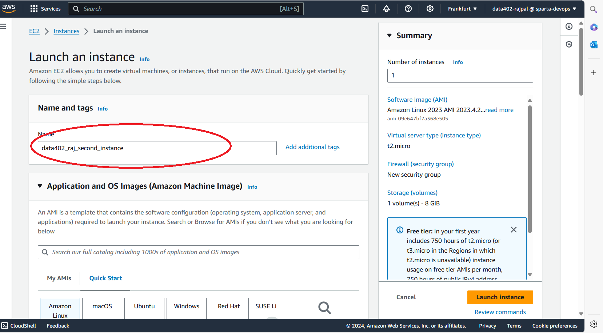
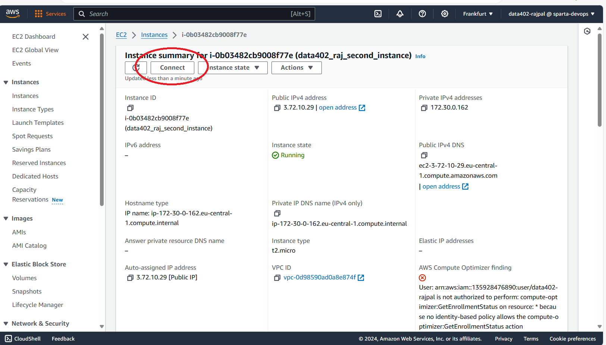
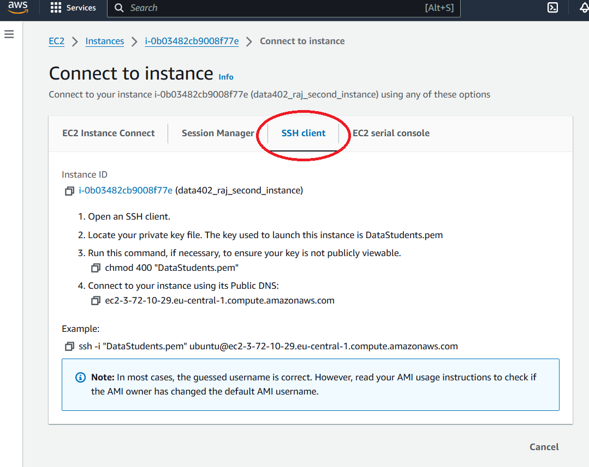
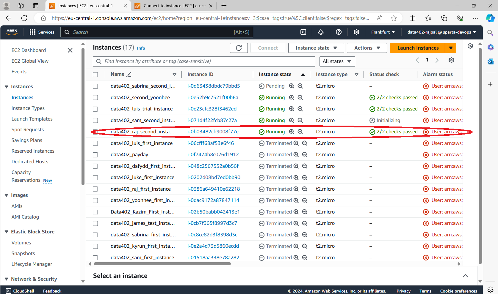

# AWS EC2

### Click on Instances


### Click on Launch instances


### Give it an appropriate name & description


### Select the server. Here we choose ```Ubuntu 22.04```


### Select Instance Type. Here we choose ```t2.micro```


### Select the Key Pair login. Ours is ```DataStudents```


### Create or select a security group 


### Review the summary before launching


### Click on the instance to view the details, click connect


### Click on the SSH Client tab


```cd``` into the ```.ssh``` directory & run ```chmod 400 "DataStudents.pem"``` command


### Connect to your instance using public DNS e.g.
```ssh -i "DataStudents.pem" ubuntu@ec2-3-72-10-29.eu-central-1.compute.amazonaws.com```


### View the status of your Instance in the Instance tab


### Enter ```exit``` to close the connection 
