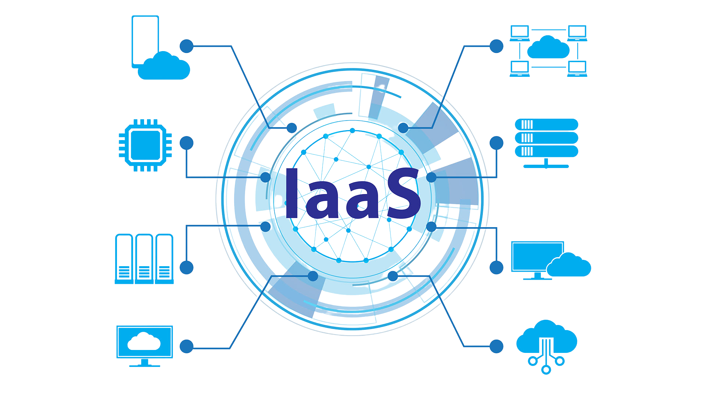

# What is Cloud Computing?

Cloud Computing is the delivery of various services over the internet, such as storage, computing power, and applications. Instead of using local servers or personal devices, these services are accessed and managed online.

**Example**: When you use Google Drive to store your files or Netflix to stream movies, you are using cloud computing services.

**Key Takeaway**: Cloud computing allows you to access and use resources over the internet, providing flexibility and scalability without the need for physical infrastructure.

## How Do We Know if Something is in the Cloud?

If a service or application is accessible via the internet and you don't need to install or manage it on your local device, it’s likely in the cloud.

**Example**: Using email services like Gmail or Office 365, where your emails are stored online and can be accessed from any device.

**Key Takeaway**: If you can access and use a service via the internet without local installation, it’s likely a cloud-based service.

## Differences Between On-Prem and the Cloud

### On-Premises (On-Prem)
Resources are hosted in-house, within an organization’s physical location.

### Cloud
Resources are hosted online by a third-party provider.

**Example**: Hosting a website on your own servers (on-prem) vs. using AWS or Azure (cloud).

**Key Takeaway**: On-prem requires physical infrastructure and maintenance by the organisation, while cloud services are managed by external providers and accessed via the internet.

## The 4 Deployment Models of Cloud: Private vs Public vs Hybrid vs Multi-Cloud
### Private Cloud 

Exclusive to one organization, offering control and security.

### Public Cloud 

Services are provided over the internet by third-party providers to multiple organisations.

### Hybrid Cloud 

Combines private and public clouds, allowing data and applications to be shared between them.

### Multi-Cloud 

Use of multiple cloud services from different providers.

**Example**: A company might use a private cloud for sensitive data and a public cloud for less critical applications (hybrid).

**Key Takeaway**: Different deployment models offer varying levels of control, flexibility, and security to meet diverse business needs.

## How Do They Work?
| **Cloud Type**        | **How They Work**                                                                   |
|-------------------|---------------------------------------------------------------------------------|
| **Private Cloud** | Hosted on the organisation’s own servers or a dedicated provider.               |
| **Public Cloud**      | Hosted on the provider’s infrastructure, shared among multiple users.           |
| **Hybrid Cloud**      | Integrates private and public clouds, often using orchestration tools.          |
| **Multi-Cloud**       | Utilises multiple public clouds, often for redundancy and specialised services. |

**Key Takeaway**: Each model works by providing computing resources with different levels of exclusivity and integration.

## Types of Cloud Services
**IaaS, PaaS, SaaS - What are Differences?**

| Type of Cloud Service     | Description                                                                                         |
|---------------------------|-----------------------------------------------------------------------------------------------------|
| Infrastructure as a Service (IaaS) | Provides virtualised computing resources over the internet.                                       |
| Platform as a Service (PaaS)       | Provides hardware and software tools over the internet, mainly for application development.         |
| Software as a Service (SaaS)       | Delivers software applications over the internet, on a subscription basis.                           |

**Examples**:

### IaaS - AWS EC2 (virtual servers)

### PaaS - Google App Engine (application development platform)

### SaaS - Microsoft Office 365 (online applications)

**Key Takeaway**: Cloud services range from basic infrastructure (IaaS) to complete applications (SaaS), catering to different levels of user needs.

## Advantages/Disadvantages of the Cloud (Particularly for a Business)
### Advantages:

**Cost Savings**: Pay only for what you use.

**Scalability**: Easily scale up or down based on demand.

**Accessibility**: Access from anywhere with internet.

**Maintenance**: Providers handle maintenance and updates.
### Disadvantages:

**Security Concerns**: Data is stored off-premises.

**Downtime**: Dependent on internet connectivity.

**Limited Control**: Less control over infrastructure.

**Key Takeaway**: The cloud offers significant benefits in terms of cost and flexibility but comes with considerations regarding security and control.

## Difference Between OpEx vs CapEx and How it Relates to the Cloud

| Expense Type          | Description                                                |
|-----------------------|------------------------------------------------------------|
| Operating Expenses    | Ongoing costs for running a business (e.g., cloud service subscriptions). |
| Capital Expenses      | Upfront costs for physical assets (e.g., servers, data centers).           |

**Key Takeaway**: Cloud services often shift costs from CapEx to OpEx, making budgeting more predictable and flexible.

## Is Migrating to the Cloud Always Cheaper?
Not necessarily. While cloud services can reduce CapEx, the total cost depends on usage patterns, data transfer costs, and the specific needs of the organisation. For some, the long-term costs of cloud services might be higher than maintaining on-prem solutions.

**Key Takeaway**: While cloud migration can offer cost savings, it’s essential to evaluate the total cost of ownership based on your specific use case.

## Market Share - What is the Breakdown?
As of recent data, the major cloud providers include:

1. **Amazon Web Services (AWS)**

2. **Microsoft Azure**

3. **Google Cloud Platform (GCP)**

## What are the 3 Largest Cloud Providers Known For?

| Cloud Provider | What They're Known For                                      |
|----------------|-------------------------------------------------------------|
| AWS            | Extensive services and global reach, pioneered the cloud market. |
| Azure          | Strong integration with Microsoft products and services.     |
| Google Cloud   | Advanced machine learning and data analytics capabilities.   |

**Key Takeaway**: Each provider has unique strengths, making them popular in different segments of the market.

## Which Cloud Provider Do You Think Might Be the Best? Why?
The "best" provider depends on specific needs:

| Cloud Provider | What They're Best For                                   |
|----------------|---------------------------------------------------------|
| AWS            | Best for a wide range of services and scalability.      |
| Azure          | Best for enterprises already using Microsoft products.  |
| Google Cloud   | Best for data analytics and machine learning.           |

**Key Takeaway**: The choice of provider should align with your specific technical and business requirements.

## What Sorts of Things Do You Usually Need to Pay for When Using the Cloud?
| Expense Type        | Description                           |
|---------------------|---------------------------------------|
| Compute Resources   | Virtual servers, container services.  |
| Storage             | Object storage, databases.            |
| Data Transfer       | Bandwidth costs for data movement.    |

**Additional Services**: Machine learning, analytics, IoT.

**Key Takeaway**: Cloud costs vary based on resource usage, storage, data transfer, and additional services.

## How is Data Used/Managed in the Cloud? What Do Data Professionals Need to Know?
Data in the cloud is stored, processed, and analysed using cloud-based tools and services. Data professionals need to understand cloud architectures, data integration, security, and compliance to leverage these technologies effectively.

**Key Takeaway**: Effective use of cloud data services requires knowledge of cloud platforms, data management practices, and security considerations.

# Case Studies

## Netflix

**Overview**:

Netflix, the global streaming giant, decided to migrate to the cloud to support its rapid growth and provide a seamless streaming experience to millions of users worldwide.

**Challenges**:

- Scaling infrastructure to handle increasing content and user base.

- Ensuring high availability and reliability of streaming services.

- Managing data storage and analytics for personalized recommendations.

**Solution**:

Netflix migrated its entire infrastructure to Amazon Web Services (AWS). 
This included:

- Using Amazon EC2 for scalable computing power.

- Leveraging Amazon S3 for durable and scalable storage.

- Utilising AWS data analytics services for real-time recommendations and insights.

**Benefits**:

- Scalability: 
Netflix can now handle millions of concurrent streams without downtime.

- Reliability: 
AWS's global infrastructure ensures high availability and disaster recovery.

- Efficiency: 
Improved data processing and analytics for personalized user experiences.

Key Takeaway: 
Migrating to AWS allowed Netflix to scale its services globally, enhance reliability, and provide personalized content recommendations, thereby improving user satisfaction and engagement.

## Airbnb

**Overview**:

Airbnb, the popular online marketplace for lodging and tourism experiences, needed a flexible and scalable infrastructure to manage its growing platform and improve data insights.

**Challenges**:

- Handling rapid growth in user base and listings.

- Managing data for personalized search and recommendations.

- Ensuring high performance and uptime during peak times.

**Solution**:

Airbnb migrated its infrastructure to Amazon Web Services (AWS) to take advantage of the cloud's scalability and data management capabilities:

- Using AWS Elastic Load Balancing to distribute traffic and handle peaks.

- Leveraging Amazon RDS and Amazon S3 for reliable data storage and management.

- Implementing AWS data analytics tools to gain insights and optimize search algorithms.

**Benefits**:

- Scalability: 
Easily managed growing user demands and traffic spikes.

- Performance: 
Improved search and recommendation systems for users.

- Data Insights: 
Enhanced data analytics for better business decisions.

**Key Takeaway**: 
By migrating to AWS, Airbnb achieved the flexibility and scalability needed to support its expanding platform, improving both performance and user satisfaction.

## General Electric (GE)

**Overview**:
General Electric (GE), a multinational conglomerate, sought to modernize its IT infrastructure and improve operational efficiency through cloud migration.

**Challenges**:

- Modernising legacy systems and reducing IT costs.

- Enhancing data analytics capabilities for better decision-making.

- Increasing operational efficiency and agility.

**Solution**:
GE embarked on a cloud transformation journey using Microsoft Azure:

- Migrated legacy applications and workloads to Azure.

- Leveraged Azure's data analytics and IoT services to gain insights from industrial data.

- Utilised Azure Machine Learning for predictive maintenance and optimisation.

**Benefits**:

- Cost Savings: 
Reduced IT infrastructure costs by moving to a pay-as-you-go model.

- Operational Efficiency: 
Streamlined operations and improved agility.

- Data-Driven Insights: 
Enhanced analytics capabilities for better decision-making and predictive maintenance.

**Key Takeaway**: 
GE's migration to Microsoft Azure helped modernize its IT infrastructure, reduce costs, and leverage advanced analytics and IoT capabilities to improve operational efficiency and decision-making.

### Conclusion
These case studies illustrate how businesses can leverage cloud computing to scale their operations, improve performance, and gain valuable insights from data. By choosing the right cloud solutions, companies can address specific challenges and achieve significant improvements.