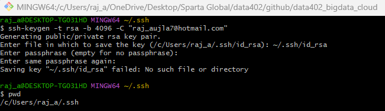

# SSH Keys & Github

## Step 1: Open Git Bash
```
cd 
```
This command changes the directory to the home directory of your user. In Git Bash, this is typically ```C:/Users/<your-username>.```

## Step 2: Create .ssh Directory
```
mkdir .ssh
```
This command creates a new directory named .ssh in your home directory. The .ssh directory is commonly used to store SSH keys and related configuration files.

## Step 3: Navigate to .ssh Directory
```
cd .ssh
```
This command changes the directory to the newly created .ssh directory. This is where you will generate and store your SSH key.



## Step 4: Generate SSH Key
```
ssh-keygen -t rsa -b 4096 -C "raj_aujla7@hotmail.com"
```
```ssh-keygen```: This is the command to generate a new SSH key.

```-t rsa```: Specifies the type of key to create, in this case, RSA.

```-b 4096```: Specifies the number of bits in the key, 4096 is a strong level of encryption.

```-C "raj_aujla7@hotmail.com"```: Adds a comment to the key, typically an email address to identify the key.

This command will prompt you to enter a file in which to save the key. You can press Enter to accept the default location ```(~/.ssh/id_rsa)```.

## Step 5: Display the Public Key
```
cat git_test_key.pub
```
This command displays the contents of your public key file. You'll copy this key to GitHub. Note: Replace ```git_test_key.pub``` with ```id_rsa.pub``` if you used the default file name during key generation.

## Step 6: Add SSH Key to GitHub
Go to your repository's page on GitHub.
Navigate to Settings > Deploy keys.
Click on Add deploy key.
Enter a title for the key, check Allow write access if needed.
Paste the public key you copied from the previous step.
Click Add key.

## Step 7: Add SSH Key to SSH Agent
```
cd 
ssh-add ~/.ssh/git_test_key
```
```cd```: Navigate back to your home directory.

```ssh-add ~/.ssh/git_test_key```: This command adds your SSH private key to the SSH agent so you can use it without entering your passphrase each time. Note: Replace ```git_test_key``` with ```id_rsa``` if you used the default file name during key generation.

## Step 8: Test SSH Connection to GitHub
```
ssh -T git@github.com
```
This command tests the SSH connection to GitHub. If successful, you should see a message like:

```Hi raj_aujla7! You've successfully authenticated, but GitHub does not provide shell access.```


## Step 9: Clone Repository Using SSH
```
git clone git@github.com:username/repo.git
```
This command clones a GitHub repository using SSH. Replace username with your GitHub username and repo with the name of your repository.

## Summary
The above steps set up SSH keys for secure communication between your local machine and GitHub. This method is preferred over HTTPS because it doesn't require you to enter your username and password each time you interact with the remote repository. Instead, it uses the SSH key pair (public and private keys) for authentication.

# Deleting SSH Key & Repo Then Re-creating 

## Part 1: Deleting the Test Repository and SSH Keys

### Step 1: Delete the Test Repository

Open Git Bash

Navigate to the Directory Containing Your Repository

```cd /c/Users/raj_a/OneDrive/Desktop/Sparta\ Global/data402/github```

Delete the Local Repository

```rm -rf data402_ssh_testing```

Delete the Remote Repository

Go to GitHub and log in.

Navigate to the repository ```RajAujla01/data402_ssh_testing```.

Click on the **Settings** tab.

Scroll down to the **"Danger Zone"** section.

Click **Delete this repository**.

Confirm the deletion by typing the repository name and clicking the confirm button.

### Step 2: Delete the SSH Keys

Open Git Bash

Navigate to the .ssh Directory

```
cd ~/.ssh
```

List SSH Keys to Verify
```
ls
```
Delete the SSH Key Files
```
rm git_test_key git_test_key.pub
```
Navigate Out of the .ssh Directory
```
cd
```
## Part 2: Setting Up SSH Keys for an Existing GitHub Repository

### Step 1: Generate a New SSH Key

Open Git Bash

Navigate to the Home Directory
```
cd
```
Create the .ssh Directory if It Doesn't Exist
```
mkdir -p .ssh
cd .ssh
```
Generate a New SSH Key
```
ssh-keygen -t rsa -b 4096 -C "raj_aujla7@hotmail.com"
```
When prompted, save the file as ~/.ssh/id_rsa (the default location).
Enter a passphrase for added security.


Navigate Out of the .ssh Directory
```
cd
```
### Step 2: Add the SSH Key to the SSH Agent

Ensure the SSH Agent is Running
```
eval "$(ssh-agent -s)"
```
Add Your SSH Private Key to the SSH Agent
```
ssh-add ~/.ssh/id_rsa
```
### Step 3: Add the SSH Key to Your GitHub Account
Copy the SSH Key to Your Clipboard
```
cat ~/.ssh/id_rsa.pub
```
Select and copy the output.

Add the SSH Key to GitHub

Go to GitHub and log in.

Click on your profile icon in the top right corner and go to **Settings**.

In the left sidebar, click **SSH and GPG keys**.
Click **New SSH key**, provide a title, and paste your key.

Click **Add SSH key**.

### Step 4: Switch an Existing Repository to Use SSH

Open Git Bash

Navigate to Your Local Repository
```
cd "C:\Users\raj_a\OneDrive\Desktop\Sparta Global\data402\github\data402_bigdata_cloud"
```
Verify the Current Remote URL
```
git remote -v
```
Change the Remote URL to Use SSH
```
git remote set-url origin git@github.com:RajAujla01/data402_bigdata_cloud.git
```
Verify the Change
```
git remote -v
```
Test the Connection
```
ssh -T git@github.com
```
SSH (Secure Shell) is a protocol used to securely connect to remote systems. It encrypts the connection between a client and a server, ensuring secure data transfer and command execution. In the context of GitHub, SSH keys are used to authenticate your identity without needing to enter your username and password for every interaction.

## Lock and Key

**Public Key (Lock)**: Can be shared openly and placed on servers (e.g., GitHub).

**Private Key (Key)**: Kept secure on your local machine. Never share this.

When you try to connect to the server, your private key "unlocks" the connection established by the public key, confirming your identity.

## Summary
Following these steps, you successfully delete your test repository and SSH keys, generate new SSH keys, add them to GitHub, and switch an existing repository to use SSH. This process improves security and streamlines your workflow with GitHub.